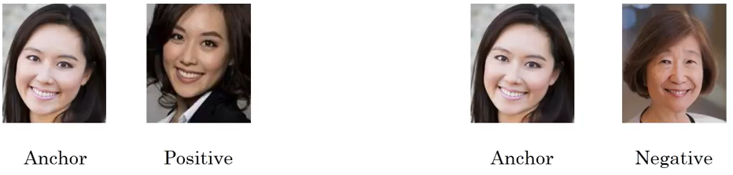

# Bài 2

### Công thức toán học Triplet Loss:

$$
L(A, P, N) = \max \left(0, \|f(A) - f(P)\|_2^2 - \|f(A) - f(N)\|_2^2 + \alpha \right)
$$

Trong đó:
- \( A \) là mẫu anchor.
- \( P \) là mẫu positive.
- \( N \) là mẫu negative.
- \( f \) là hàm biểu diễn đặc trưng (ví dụ: mạng neural).
- \( \| \cdot \|_2 \) là chuẩn Euclidean.
- \( \alpha \) Là một ngưỡng (margin) được xác định trước, giúp đảm bảo rằng khoảng cách giữa hình ảnh neo và hình ảnh âm phải lớn hơn khoảng cách giữa hình ảnh neo và hình ảnh dương một cách tối thiểu.

Ví dụ : so sánh khuôn mặt

### Triplet Loss

Giả sử không có \( \alpha \). Mong muốn là \(\|f(A) - f(P)\|_2^2 \leq \|f(A) - f(N)\|_2^2\), nhưng nếu \(\|f(A) - f(P)\|_2^2 = 0.5\) và \(\|f(A) - f(N)\|_2^2 = 0.51\), thì khi đó:

\[
\max \left(0, \|f(A) - f(P)\|_2^2 - \|f(A) - f(N)\|_2^2 \right) = \max\left(0, 0.5 - 0.51\right) = \max\left(0, -0.01\right) = 0
\]

Khi hàm mất mát bằng 0, điều này có thể dẫn đến việc mô hình không học được gì nhiều. 

Vậy khi thêm \( \alpha = 0.2 \), kết quả là:

\[
\max\left(0, \|f(A) - f(P)\|_2^2 - \|f(A) - f(N)\|_2^2 + \alpha \right) = \max\left(0, 0.5 - 0.51 + 0.2\right) = \max\left(0, 0.19\right) = 0.19
\]

Khi đó, mô hình có thể học thêm được.

### Công thức toán học Triplet Loss với nhiều mẫu Positive và Negatives

Với \( k \) mẫu positive và \( m \) mẫu negative, công thức được mở rộng thành:

$$
L = \sum_{i=1}^{k} \sum_{j=1}^{m} \max \left(0, \|f(A) - f(P_i)\|_2^2 - \|f(A) - f(N_j)\|_2^2 + \alpha \right)
$$

Trong đó:
- \( P_i \) là các mẫu positive (có \( k \) mẫu).
- \( N_j \) là các mẫu negative (có \( m \) mẫu).

**Khi có nhiều mẫu positive và negative trong quá trình huấn luyện thì sẽ ảnh hướng đến hàm loss như thế nào ?**
ví dụ với so sánh khuôn mặt:
- Việc có nhiều hình ảnh positive cho cùng một hình ảnh anchor giúp mô hình có thể học được nhiều đặc điểm khác nhau của cùng một người. Điều này có thể làm cho mô hình trở nên chính xác hơn trong việc nhận diện khuôn mặt, vì nó có thể hiểu rõ hơn về sự biến đổi trong các hình ảnh của cùng một người (ví dụ: khác nhau về ánh sáng, góc chụp, biểu cảm).
- Tương tự, nếu có nhiều hình ảnh negative, mô hình có thể học được cách phân biệt giữa các khuôn mặt khác nhau một cách hiệu quả hơn.
